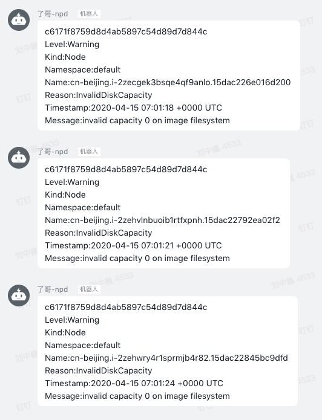

# kubernetes-events-generator
kubernetes-events-generator is command line to generate events in one kubernetes cluster

## How to run it?
```
---
apiVersion: apps/v1
kind: Deployment
metadata:
  name: kubernetes-events-generator
  namespace: kube-system
  labels:
    app: kubernetes-events-generator
spec:
  replicas: 1 # The default is primary and standby mode (currently cold standby)
  selector:
    matchLabels:
      app: kubernetes-events-generator
  template:
    metadata:
      labels:
        app: kubernetes-events-generator
    spec:
      containers:
      - command:
        - /root/kubernetes-events-generator
        image: registry.aliyuncs.com/ringtail/kubernetes-events-generator:0.2
        imagePullPolicy: Always
        name: kubernetes-events-generator
        resources:
          limits:
            cpu: 100m
            memory: 100Mi
          requests:
            cpu: 100m
            memory: 100Mi
      serviceAccount: admin
```
Then you can get Events from kube-eventer DingTalk Bot. 
<p></p>   

## Related projects 
<a href="https://github.com/AliyunContainerService/kube-eventer">kube-eventer</a>: kube-eventer emit kubernetes events to sinks.
